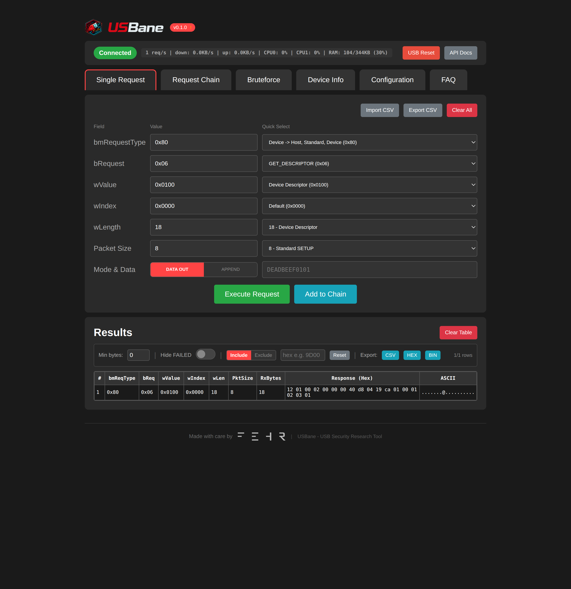
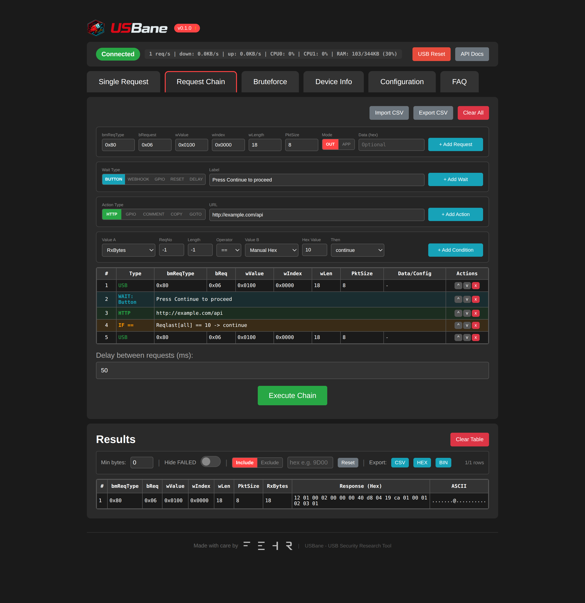
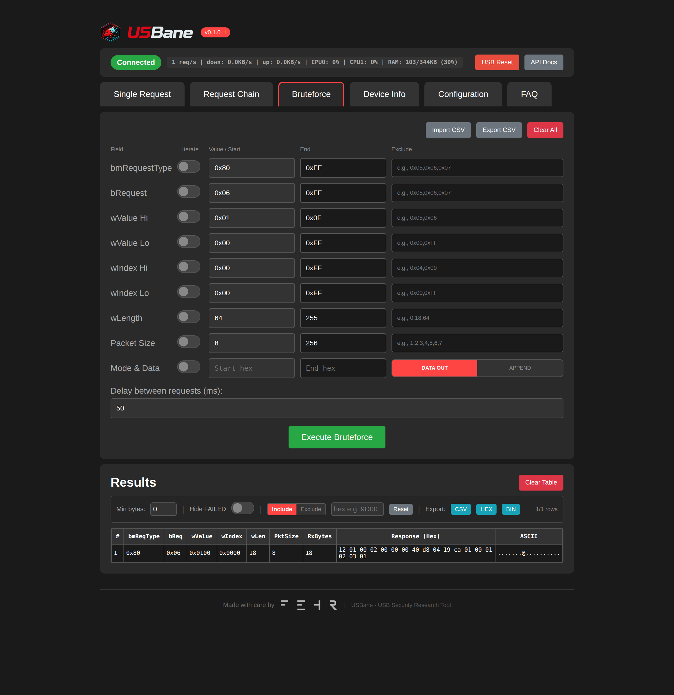
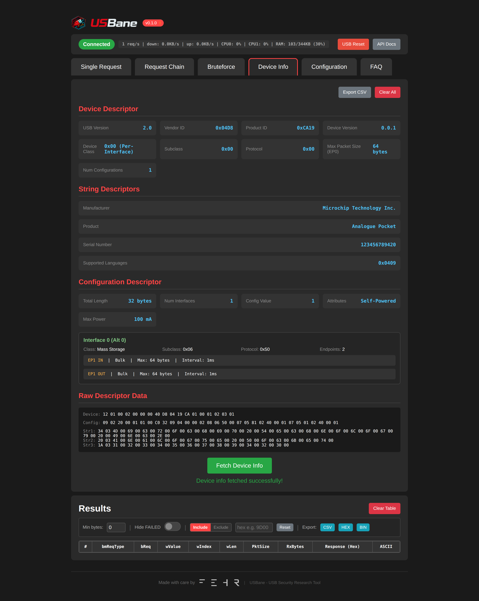

<p align="center">
  
  
</p>

[](https://github.com/FehrGmbH/usbane/actions/workflows/build.yml)
[](https://www.gnu.org/licenses/gpl-3.0)
[](https://www.espressif.com/en/products/socs/esp32-s3)
[](https://github.com/espressif/esp-idf)
[](https://github.com/FehrGmbH/usbane/releases)

<p align="center"><b>USB Security Research Tool for ESP32-S3</b></p>

USBane is an open-source USB security research framework that enables direct hardware access to the DWC2 USB controller on ESP32-S3, bypassing standard USB stack validation for security testing and vulnerability research.

## Screenshots

<p align="center">
  <a href="sample_images/1.png"></a>
  <a href="sample_images/2.png"></a>
</p>
<p align="center">
  <a href="sample_images/3.png"></a>
  <a href="sample_images/4.png"></a>
</p>

## Features

- **Direct USB Hardware Access** - Bypasses ESP-IDF USB Host stack for low-level control
- **Web Interface** - Real-time control via browser (WiFi AP or Client mode)
- **REST API with OpenAPI Documentation** - Full API documentation with Swagger UI for scripting and automation
- **Dual-Core Architecture** - Core 0 handles WiFi/HTTP, Core 1 handles USB operations
- **Malformed Packet Support** - Send truncated, oversized, or custom USB packets
- **Advanced Request Chains** - Powerful automation with:
  - **Wait Conditions**: Button prompts, webhooks, GPIO triggers, USB resets, delays
  - **Actions**: HTTP calls, GPIO control, comments, dynamic data copying, GOTO jumps
  - **Conditionals**: Compare responses with operators (==, !=, <, >, <=, >=, contains), skip steps or break execution
  - **Dynamic Data**: Copy response bytes between requests, reference previous results
- **Bruteforce Mode** - Iterate through parameter ranges with exclude lists and retry logic
- **Device Info** - Automatic USB descriptor parsing and display
- **Import/Export** - CSV support for sharing configurations and request chains
- **Real-time Monitoring** - Live USB statistics, CPU load, heap usage
- **Automatic Updates** - GitHub release version checking (when connected to internet)
- **Factory Reset** - One-click restore to default settings

## Hardware Requirements

- ESP32-S3 development board with USB OTG support
- **Minimum 8MB flash** recommended (supports OTA updates)
- USB OTG cable/adapter for connecting target devices
- Target USB device for testing
- (Optional) GPIO pins for hardware triggers/control

## Quick Start

### Prerequisites
- ESP-IDF v5.x installed and configured
- ESP32-S3 board with 8MB+ flash

### Build and Flash

```bash
# Set target
idf.py set-target esp32s3

# Build (flash size configured in sdkconfig.defaults)
idf.py build

# Flash to device
idf.py flash

# (Optional) Monitor serial output
idf.py monitor
```

### Connect and Access

1. **Connect to WiFi**
   - SSID: `USBane`
   - Password: `usbane123`

2. **Open Web Interface**
   - Navigate to `http://192.168.4.1`
   - Or use Client Mode to connect to your network

## Web Interface

| Tab | Description |
|-----|-------------|
| Single Request | Send individual USB control transfers with custom data |
| Request Chain | Execute automated sequences with wait conditions, actions, and flow control |
| Bruteforce | Iterate through parameter ranges with filtering and retry logic |
| Device Info | View and parse USB device, configuration, and string descriptors |
| Configuration | WiFi modes, USB PHY settings, retry behavior, factory reset |
| FAQ | Comprehensive usage documentation and examples |

Access the main interface at: `http://192.168.4.1/` (default AP mode)

## API Documentation

Interactive API documentation with OpenAPI/Swagger UI is available at: `http://192.168.4.1/api`

The REST API enables:
- **Scriptable attacks** - Automate USB fuzzing campaigns with Python, curl, or any HTTP client
- **Integration** - Connect USBane with security testing frameworks and CI/CD pipelines
- **Programmatic control** - Send USB requests, configure settings, manage chains via HTTP
- **Remote monitoring** - Query device status, statistics, and results

Example API usage:
```bash
# Send a USB control request
curl -X POST "http://192.168.4.1/api/send_request?bmRequestType=0x80&bRequest=0x06&wValue=0x0100&wIndex=0x00&wLength=18"

# Get device status
curl "http://192.168.4.1/api/status"

# Reset USB device
curl -X POST "http://192.168.4.1/api/reset"
```

See `/api` for complete endpoint documentation with interactive testing.

## Configuration

### WiFi Modes
- **Access Point** (default): ESP32 creates its own network
- **Client Mode**: Connect to existing router (fallback AP always available)

### USB Settings
- USB Speed: Full-Speed (12 Mbps) or Low-Speed (1.5 Mbps)
- Device Address, Endpoint, Max Packet Size configurable

## Request Chain Capabilities

Request chains enable complex automation scenarios with powerful flow control:

### Wait Types
- **Button** - Pause for manual user confirmation
- **Webhook** - Wait for external HTTP trigger
- **GPIO** - Wait for hardware signal (pin goes HIGH/LOW)
- **USB Reset** - Reset USB device state
- **Delay** - Fixed time delay (milliseconds)

### Actions
- **HTTP** - Call external APIs or webhooks
- **GPIO Output** - Control hardware pins
- **Comment** - Add documentation to chain execution
- **Copy** - Extract data from responses and inject into subsequent requests
- **GoTo** - Jump to specific chain index for loops

### Conditionals
- **Operators**: `==`, `!=`, `<`, `>`, `<=`, `>=`, `contains`
- **Sources**: Compare received bytes, response hex data, or manual values
- **Outcomes**: Continue, skip next step, or break execution
- **Use Cases**: Error handling, adaptive fuzzing, state validation

### Example Use Cases
- Enumerate descriptors with dynamic length extraction
- Implement retry logic with conditional breaks
- Create feedback loops for iterative testing
- Automate multi-stage exploitation chains
- Validate device responses before proceeding

## Project Structure

```
├── main/
│   ├── html/           # Web interface files
│   │   ├── index.html      # Main UI
│   │   ├── app.js          # UI logic
│   │   ├── api.html        # API documentation UI
│   │   ├── openapi.json    # OpenAPI specification
│   │   ├── applogo.png     # Application logo
│   │   ├── apptext.svg     # Application text logo
│   │   ├── favicon.ico     # Browser favicon
│   │   └── logo.svg        # SVG logo
│   ├── main.c          # Application entry point
│   ├── usb_malformed.c # USB hardware access layer
│   ├── web_interface.c # HTTP server and API endpoints
│   └── wifi_ap.c       # WiFi AP/STA management
├── sample_images/      # Application screenshots
├── applogo.png         # High-res logo for README
├── apptext.svg         # Logo text for README
├── CMakeLists.txt
├── sdkconfig.defaults
└── COPYING
```

## Disclaimer

⚠️ **This tool is intended for security research, education, and authorized testing only.**

- Only use on devices you own or have explicit permission to test
- Users are responsible for complying with all applicable laws and regulations
- The authors are not responsible for any misuse or damage caused by this tool
- Some USB operations may cause device malfunction or data loss

## License

Copyright 2026 [Fehr GmbH](https://fe.hr)

This program is free software: you can redistribute it and/or modify it under the terms of the GNU General Public License as published by the Free Software Foundation, either version 3 of the License, or (at your option) any later version.

See [COPYING](COPYING) for the full license text.

## Contributing

Contributions are welcome! Please ensure your code follows the existing style and includes appropriate documentation.

## Links

- **Website**: [https://fe.hr](https://fe.hr)
- **Issues**: Report bugs and feature requests via GitHub Issues
